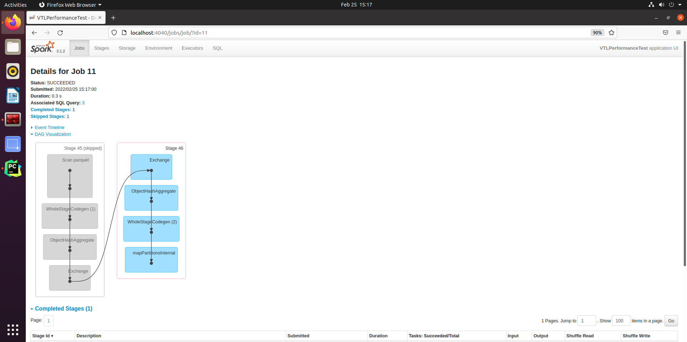
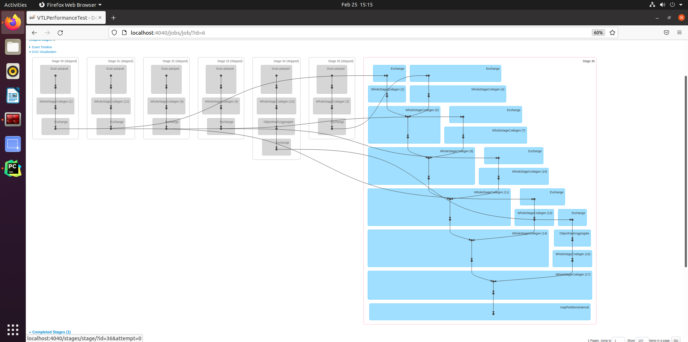

# Performance test 

Here I compare the performance between:
- AggregateDynamicExample: simulate execute all aggregate actions with one single groupby without join in processingEngine.executeAggr()
- joinIndividualAggExample: simulate execute aggregate action in each visit then join the result in processingEngine.executeAggr()

## Test environment

- hardware: 4 vcore, 6GB ram

- software: Linux ubuntu 5.13.0-30-generic

## Test data source

The test data is from [san francisco fire department](https://data.sfgov.org/Public-Safety/Fire-Incidents/wr8u-xric).

**It contains 5500519 rows in total**

Below is the schema:

```text
root
 |-- CallNumber: integer (nullable = true)
 |-- UnitID: string (nullable = true)
 |-- IncidentNumber: integer (nullable = true)
 |-- CallType: string (nullable = true)
 |-- CallDate: string (nullable = true)
 |-- WatchDate: string (nullable = true)
 |-- ReceivedDtTm: string (nullable = true)
 |-- EntryDtTm: string (nullable = true)
 |-- DispatchDtTm: string (nullable = true)
 |-- ResponseDtTm: string (nullable = true)
 |-- OnSceneDtTm: string (nullable = true)
 |-- TransportDtTm: string (nullable = true)
 |-- HospitalDtTm: string (nullable = true)
 |-- CallFinalDisposition: string (nullable = true)
 |-- AvailableDtTm: string (nullable = true)
 |-- Address: string (nullable = true)
 |-- City: string (nullable = true)
 |-- ZipcodeofIncident: integer (nullable = true)
 |-- Battalion: string (nullable = true)
 |-- StationArea: string (nullable = true)
 |-- Box: string (nullable = true)
 |-- OriginalPriority: string (nullable = true)
 |-- Priority: string (nullable = true)
 |-- FinalPriority: integer (nullable = true)
 |-- ALSUnit: boolean (nullable = true)
 |-- CallTypeGroup: string (nullable = true)
 |-- NumberofAlarms: integer (nullable = true)
 |-- UnitType: string (nullable = true)
 |-- Unitsequenceincalldispatch: integer (nullable = true)
 |-- FirePreventionDistrict: string (nullable = true)
 |-- SupervisorDistrict: string (nullable = true)
 |-- NeighborhoodDistrict: string (nullable = true)
 |-- Location: string (nullable = true)
 |-- RowID: string (nullable = true)
```

## Test cases

### Case 1: Only one aggregation function(e.g. count) in groupBy 

query detail :
```sql
Select CallType, count(*) as countVal  from users group by CallType
```

```text
Duration of AggregateDynamic: 1106572774 nano seconds
Duration of joinIndividualAgg: 690382969 nano seconds
Time gap: -416 milli seconds
```

Conclusion : joinIndividualAggExample is quicker. Because to generate sql query dynamically, I need to use spark
to create a tempView and call sql query on it. This adds a layer which requires spark context to translate it to spark
function first. This adds extra time to AggregateDynamicExample. As joinIndividualAggExample has only one aggregation function, so I use spark function directly. This is quicker compare to calling sql on tempView. 

### Case 2: 5 aggregation function in groupBy

query detail : 
```sql
Select CallType, sum(NumberofAlarms) as sumNumberofAlarms, min(NumberofAlarms) as minNumberofAlarms, avg(NumberofAlarms) as avgNumberofAlarms, max(NumberofAlarms) as NumberofAlarms, count(*) as countVal  from users group by CallType
```

```text
Duration of AggregateDynamic: 1226310726 nano seconds
Duration of joinIndividualAgg: 3605542392 nano seconds
Time gap: 2379 milli seconds
```

Conclusion : This time AggregateDynamicExample is much quicker. Because even with the tempView layer, one dynamic join is much faster than
joining the result of multiply group by. 

### Case 3: 6 aggregation function in groupBy

query detail : (one aggregation on categorical column)
```sql
Select CallType, sum(NumberofAlarms) as sumNumberofAlarms, min(NumberofAlarms) as minNumberofAlarms, avg(NumberofAlarms) as avgNumberofAlarms, max(NumberofAlarms) as NumberofAlarms, count(*) as countVal, collect_list(City) as allCities  from users group by CallType
```

```text
Duration of AggregateDynamic: 3672460548 nano seconds


Duration of joinIndividualAgg: 6759017360 nano seconds
Time gap: 3086 milli seconds
```

Conclusion : AggregateDynamicExample is quicker. The more aggregation functions in groupBy, the more time one single groupBy
approach can save. The column type(e.g. numeric, categorical, etc.) will not affect the end result.

## Execution plan of spark

### Execution plan of AggregateDynamicExample
Below figure is the execution plan of function AggregateDynamicExample (which uses one groupBy). You can notice that
there is only one shuffle between the two stage. The best we can do for a groupby aggregation operation.



### Execution plan of joinIndividualAggExample
Below figure is the execution plan of function joinIndividualAggExample (which joins multi groupBy). You can notice there
are **six shuffle between 7 stage**, which is not good at all.


